Here's a comprehensive breakdown of observability approaches in microservices, from foundational to advanced.

---

## The three pillars of observability

Before diving into approaches, every strategy builds on these three signals:

- **Logs** — discrete events with context (what happened)
- **Metrics** — numeric measurements over time (how much / how often)
- **Traces** — correlated spans across services (where time was spent)

---

## Approach 1: Centralized logging

All services ship logs to a central aggregation system (ELK Stack, Loki, Splunk, Datadog Logs).**Pros:** Simple to implement, great for debugging specific errors, works with any language/framework, cheap at low volume.

**Cons:** Logs alone are noisy and lack causality — you can't easily trace a single user request across 10 services. Expensive at scale if you log everything. Requires strict structured logging discipline (JSON, correlation IDs) to be useful.

---

## Approach 2: Distributed tracing

Every request gets a `trace-id` propagated via headers (W3C TraceContext). Each service emits spans that a collector stitches into a full request trace.Tooling: OpenTelemetry (vendor-neutral instrumentation), Jaeger, Zipkin, Tempo, Datadog APM.

**Pros:** Pinpoints latency bottlenecks precisely. Shows the full causal chain of a request. Invaluable for diagnosing cascading failures.

**Cons:** Requires code instrumentation (though auto-instrumentation agents help). Sampling is tricky — tracing 100% is expensive; tail-based sampling adds complexity. Context propagation breaks if any service in the chain doesn't forward headers.

---

## Approach 3: Metrics-based monitoring (RED / USE method)

Collect numeric time-series from all services, typically via Prometheus + Grafana or a commercial equivalent.

Two popular mental models for what to measure:

| Model | Stands for | Best for |
|---|---|---|
| **RED** | Rate, Errors, Duration | User-facing services (APIs) |
| **USE** | Utilization, Saturation, Errors | Infrastructure (CPU, memory, queues) |

**Pros:** Extremely low overhead. Aggregates well across instances. Enables alerting and SLOs/SLAs. Long retention for capacity planning.

**Cons:** Metrics have no context — a spike in error rate tells you *that* something broke, not *why* or *which* specific request. Cardinality explosion (too many label dimensions) can kill Prometheus.

---

## Approach 4: Unified observability platform (the "three pillars correlated")

The modern standard: correlate logs, traces, and metrics under a single pane of glass so you can jump from an alert → a trace → the relevant logs in a few clicks.**Pros:** Jump from a Grafana alert to a trace to its logs without switching tools. Single correlation ID ties everything together. OpenTelemetry is vendor-neutral so you can swap backends.

**Cons:** Higher operational complexity (running Loki + Tempo + Prometheus). Significant infrastructure cost. Teams need training to use it effectively.

---

## Approach 5: Service mesh observability (Istio / Linkerd)

Inject a sidecar proxy (Envoy) next to every service pod. The mesh automatically captures golden signals for every service-to-service call — no code changes needed.

**Pros:** Zero instrumentation burden on developers. Consistent metrics across all services regardless of language. Also handles retries, mTLS, circuit breaking.

**Cons:** Sidecar adds latency (~1–5ms per hop) and resource overhead. Mesh control plane is a complex dependency. Works best in Kubernetes — adds friction in bare-metal or mixed environments.

---

## Approach 6: Synthetic monitoring + real user monitoring (RUM)

Proactively probe your services (synthetic) and measure what real users experience in the browser/app (RUM).

**Pros:** Catches issues before real users do (synthetic). Measures actual user-perceived latency, not internal service latency. Great for SLO measurement.

**Cons:** Doesn't help with internal service-to-service debugging. Synthetic probes can miss edge-case failure modes.

---

## Comparison summary

| Approach | Strengths | Weaknesses | Best fit |
|---|---|---|---|
| Centralized logging | Simple, flexible | No causality, expensive at scale | Early-stage, debugging |
| Distributed tracing | Full request lineage | Instrumentation overhead, sampling complexity | Latency debugging, complex flows |
| Metrics (RED/USE) | Low overhead, alertable | No context, cardinality traps | SLOs, capacity planning |
| Unified platform (OTel) | Full correlation | Operational complexity | Production at scale |
| Service mesh | Zero-code telemetry | Sidecar overhead, K8s dependency | Kubernetes-native shops |
| Synthetic + RUM | User-facing truth | No internal visibility | SLA compliance, frontend perf |

---

## Recommended path

Start with **structured logging + correlation IDs** (day 1). Add **Prometheus metrics with RED dashboards** as you grow. Introduce **distributed tracing** once latency debugging becomes a recurring pain. Graduate to a **unified OTel-based stack** when multiple teams are operating services independently. Add **service mesh** only if you're already heavily on Kubernetes and need consistent policy enforcement alongside observability.

The key principle: **correlation IDs are non-negotiable from day one** — they're the thread that makes every other layer useful.