## React Hooks

Hooks are functions that let you "hook into" React state and lifecycle features from function components. Before hooks (pre-React 16.8), you had to use class components for stateful logic. Hooks changed all of that — now function components can do everything class components could, and more cleanly.

A few key rules: hooks must only be called at the top level of a component (not inside loops, conditions, or nested functions), and they can only be called from React function components or other custom hooks.

Let me walk through the landscape visually, then dive into each hook.---



### `useState` — local component state

The most fundamental hook. Returns a state value and a setter function.

```jsx
const [count, setCount] = useState(0);

// reading: count
// writing: setCount(count + 1)  or  setCount(prev => prev + 1)
```

Use `setCount(prev => prev + 1)` (functional update) whenever the new value depends on the old one — it avoids stale closure bugs.

---

### `useReducer` — complex state logic

Like `useState` but state transitions are described by an action object, handled by a pure reducer function. Great when state has multiple sub-values or when the next state depends on the previous one in a non-trivial way.

```jsx
const initialState = { count: 0, error: null };

function reducer(state, action) {
  switch (action.type) {
    case 'increment': return { ...state, count: state.count + 1 };
    case 'reset':     return initialState;
    default:          return state;
  }
}

const [state, dispatch] = useReducer(reducer, initialState);
dispatch({ type: 'increment' });
```

---

### `useEffect` — side effects

Runs after every render (or selectively). Used for data fetching, subscriptions, DOM mutations, timers. The cleanup function returned runs before the next effect and on unmount.

```jsx
useEffect(() => {
  const id = setInterval(() => setTick(t => t + 1), 1000);
  return () => clearInterval(id);   // cleanup
}, []);                              // [] = run once on mount
```

Dependency array controls when it re-runs: `[]` = once, `[val]` = when `val` changes, omitted = every render.

---

### `useLayoutEffect` — synchronous after DOM mutations

Same signature as `useEffect` but fires synchronously after DOM updates, before the browser paints. Use it when you need to measure the DOM or prevent flickering (e.g. tooltip positioning). In most cases, `useEffect` is the right choice.

---

### `useRef` — mutable ref, no re-render

Returns an object `{ current: value }` that persists across renders but updating it does **not** cause a re-render. Two main uses:

```jsx
// 1. Access DOM nodes
const inputRef = useRef(null);
<input ref={inputRef} />
// focus it: inputRef.current.focus()

// 2. Store a mutable value without triggering re-render
const prevCount = useRef(count);
```

---

### `useMemo` — memoize expensive computations

Caches the result of a computation between renders. Only re-computes when dependencies change.

```jsx
const sortedList = useMemo(
  () => items.sort((a, b) => a.name.localeCompare(b.name)),
  [items]   // only re-sorts when items array changes
);
```

Don't overuse it — React is fast, and memoization has its own overhead. Apply it when you have a measurably expensive computation.

---

### `useCallback` — memoize a function reference

Keeps a function reference stable across renders. Critical when passing callbacks to memoized child components — without it, a new function reference is created every render, defeating the memoization.

```jsx
const handleClick = useCallback(() => {
  doSomething(id);
}, [id]);   // new function only when id changes
```

---

### `useContext` — consume React context

Reads from a context object without needing a Consumer wrapper. Re-renders whenever the context value changes.

```jsx
const ThemeContext = React.createContext('light');

// In a provider:
<ThemeContext.Provider value="dark">...</ThemeContext.Provider>

// In any descendant:
const theme = useContext(ThemeContext);  // "dark"
```

---

### Custom Hooks — composing and reusing logic

A custom hook is just a function whose name starts with `use` and that calls other hooks internally. They let you extract stateful logic from components so it can be reused and tested in isolation.

Here's a practical example — a `useFetch` hook that handles loading, error, and data states for any URL:Here's the full implementation:



```jsx
// useFetch.js — the custom hook
import { useState, useEffect } from 'react';

function useFetch(url) {
  const [data, setData]       = useState(null);
  const [loading, setLoading] = useState(true);
  const [error, setError]     = useState(null);

  useEffect(() => {
    let cancelled = false;   // prevents state update on unmounted component

    setLoading(true);
    setError(null);

    fetch(url)
      .then(res => {
        if (!res.ok) throw new Error(`HTTP ${res.status}`);
        return res.json();
      })
      .then(json => { if (!cancelled) { setData(json); setLoading(false); } })
      .catch(err => { if (!cancelled) { setError(err.message); setLoading(false); } });

    return () => { cancelled = true; };  // cleanup: cancel stale response
  }, [url]);  // re-fetch whenever url changes

  return { data, loading, error };
}

export default useFetch;
```

```jsx
// UserList.jsx — consuming the hook
import useFetch from './useFetch';

function UserList() {
  const { data, loading, error } = useFetch('https://api.example.com/users');

  if (loading) return <p>Loading…</p>;
  if (error)   return <p>Error: {error}</p>;

  return (
    <ul>
      {data.map(user => <li key={user.id}>{user.name}</li>)}
    </ul>
  );
}
```

```jsx
// Reuse the same hook anywhere else — zero extra code
function PostList() {
  const { data, loading, error } = useFetch('https://api.example.com/posts');
  // same logic, different endpoint
}
```

---

### When to write a custom hook

The clearest signal is: *you have stateful logic that two or more components share, or that's complex enough to deserve a name.* Good candidates include form validation (`useForm`), window resize tracking (`useWindowSize`), local storage sync (`useLocalStorage`), WebSocket connections, debouncing (`useDebounce`), and authentication state (`useAuth`).

The naming convention `use___` is not just style — it's how React's linter (eslint-plugin-react-hooks) knows to enforce the rules of hooks inside your function.