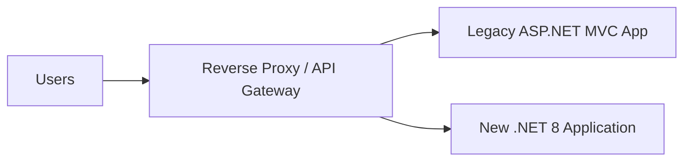
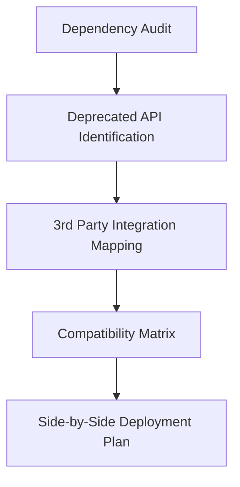
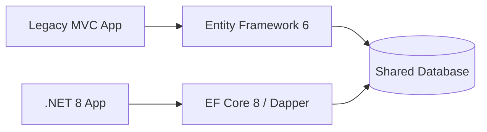
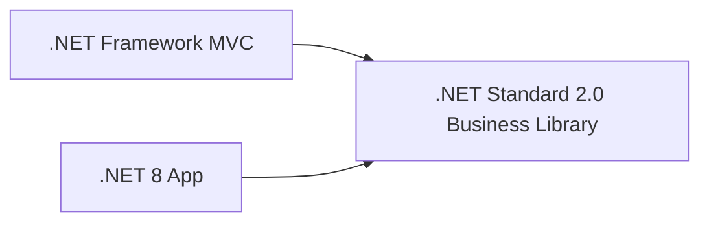
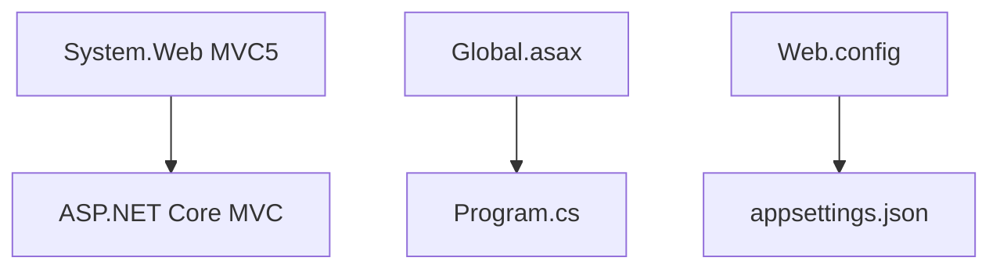
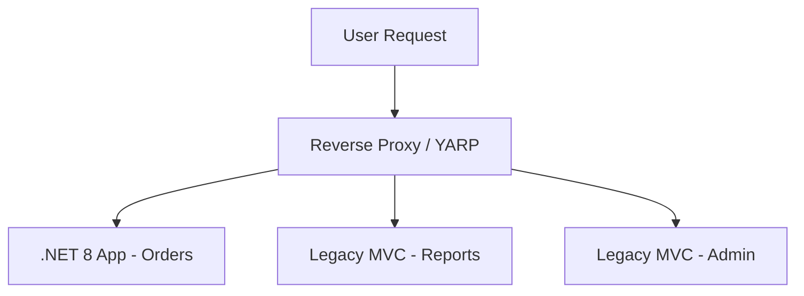
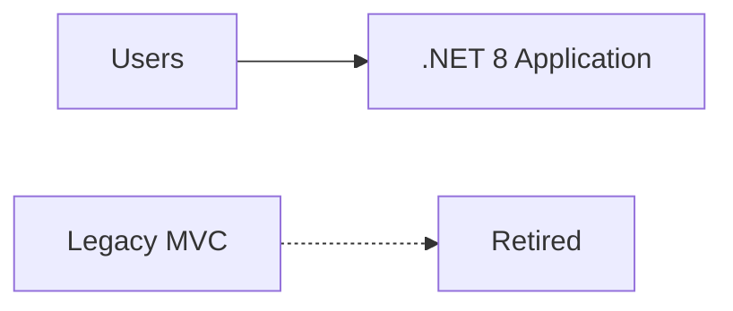
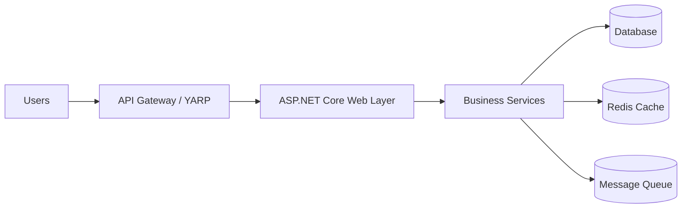

# Migrating N-Tier MVC Application to Latest .NET

A structured architectural approach for migrating a legacy **ASP.NET MVC (N-Tier)** application to **.NET 8+**.

---

# Migration Strategy
## Incremental Migration (Strangler Fig Pattern)

For an architect role interview, always advocate for **incremental migration** rather than a **big bang rewrite**.



Incremental migration allows the system to evolve **safely and gradually**, while the business continues operating.

---

# Why Incremental Over Full Migration?

| Approach | Risk Level | Business Impact |
|---|---|---|
| Full Rewrite | Very High | Feature freeze, high failure risk |
| Incremental | Low | Continuous delivery possible |

Advantages:

- Lower risk
- Continuous feature development
- Gradual team learning curve
- Easier rollback strategy

---

# Migration Phases

---

# Phase 0 — Assessment & Preparation

Before touching code, an architect must:

- Audit **NuGet dependencies**
- Identify **deprecated APIs**
- Map **external integrations**
- Define **compatibility matrix**
- Plan **side-by-side deployment**



Tools typically used:

- `dotnet upgrade-assistant`
- `ApiPort`
- Static code analyzers

---

# Phase 1 — Migrate the Data Layer

Both applications share the **same database** initially.



Steps:

- Migrate **Entity Framework 6 → EF Core**
- Move repositories and models
- Add integration tests
- Use **database-first scaffolding if schema is complex**

Benefits:

- Minimal UI disruption
- Immediate performance improvements

---

# Phase 2 — Migrate the Business Layer

Business logic should be extracted to **shared libraries**.



Why `.NET Standard 2.0`?

It acts as a **compatibility bridge** allowing both:

- .NET Framework
- .NET 8

to consume the same code.

### Modern Dependency Injection

Old MVC:

```csharp
var svc = ServiceFactory.GetOrderService();
```

New (.NET 8):

```csharp
public class OrderController(IOrderService orderService)
{
}
```

---

# Phase 3 — Migrate the Presentation Layer

Major framework differences must be addressed.



Key replacements:

| Legacy | Modern Equivalent |
|---|---|
| `System.Web.Mvc` | `Microsoft.AspNetCore.Mvc` |
| `Global.asax` | `Program.cs` |
| `Web.config` | `appsettings.json` |
| HTTP Modules | ASP.NET Core Middleware |
| FormsAuthentication | ASP.NET Core Identity / JWT |

---

# Phase 4 — Strangler Fig Routing

Both systems run simultaneously while routing requests gradually shifts to the new app.



Example routing:

| Route | Target |
|---|---|
| `/orders/*` | New .NET 8 App |
| `/reports/*` | Legacy App |
| `/admin/*` | Legacy App |

---

# Phase 5 — Decommission Legacy System

Once all routes are migrated:



The old application can now be safely **decommissioned**.

---

# Positives of Incremental Migration

| Positive | Why It Matters |
|---|---|
| Zero downtime | Business continues operating |
| Risk isolation | Failures are limited to small components |
| Easy rollback | Proxy can redirect traffic back |
| Continuous validation | Each phase tested independently |
| Developer ramp-up | Team learns modern stack gradually |
| Early performance gains | Backend improvements arrive early |
| CI/CD friendly | Smaller deployable units |

---

# Challenges of Incremental Migration

| Challenge | Mitigation |
|---|---|
| Dual maintenance | Freeze new features in legacy system |
| Data consistency | Use migration tools like Flyway/Liquibase |
| Session differences | Use Redis distributed cache |
| Authentication mismatch | Shared cookie authentication |
| Longer timeline | Break into smaller releases |
| Testing overhead | End-to-end regression tests |
| Proxy latency | Monitor and optimize network hops |

---

# Key Architect Talking Points for Interviews

1. **Start with dependency analysis using `dotnet upgrade-assistant`.**
2. **Use the Strangler Fig Pattern to enable zero-downtime migration.**
3. **Adopt .NET Standard 2.0 as a compatibility bridge.**
4. **Use Redis for shared session management.**
5. **Ensure database schema changes are backward compatible.**
6. **Measure performance improvements at every phase.**

---

# Final Architecture (Target State)



This architecture demonstrates:

- **Modern cloud-ready design**
- **Decoupled layers**
- **Scalable services**
- **High observability**

---

# Summary

Incremental migration using the **Strangler Fig Pattern** is the safest and most architecturally sound approach for modernizing legacy ASP.NET MVC systems.

It enables:

- Continuous business operations
- Lower migration risk
- Gradual modernization
- Scalable future architecture

---