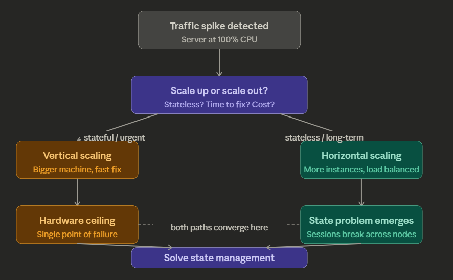
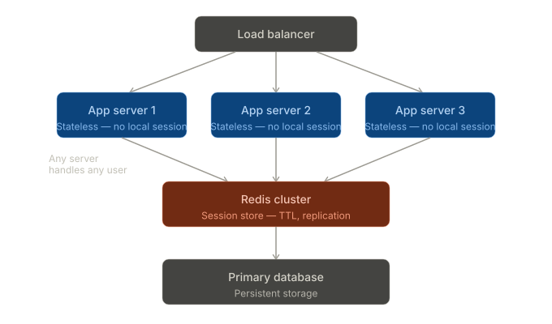

Great question — this is one of the most practically important architecture decisions in distributed systems. Let me walk through a real-world scenario and the tradeoffs involved.

## The scenario: an e-commerce platform under viral load

Imagine a mid-size e-commerce platform. Traffic is predictable for months — then a product goes viral on social media and within 30 minutes, the monolithic application server is at 100% CPU. You have two paths forward immediately.

Here's how the decision tree looks:## The choice: vertical vs horizontal

When that spike hit, the immediate band-aid was vertical scaling — resizing the EC2 instance to a larger type within minutes. No code changes, no downtime (with a quick restart), and it bought time to think. This is when vertical scaling wins: it's fast, the app is still stateful, and you need a same-day fix.

But vertical scaling hits a hard ceiling. A larger machine is also more expensive per unit of compute and is still a single point of failure. The real solution was horizontal scaling — running multiple app server instances behind a load balancer. That's when the state problem surfaces.

## The state management problem

When users log in, their session (cart, auth token, preferences) lives in server memory. With sticky sessions (session affinity), the load balancer always routes `user-X` to the same server. It works, but creates load imbalance — one server handles a celebrity's traffic spike, others sit idle — and if that server dies, the user's session is gone.

The better solution is a distributed cache. Here's how Redis changes the architecture:## How this was implemented in practice

Every app server was made fully stateless. On login, a session token is generated and the session data (`user_id`, `cart`, `permissions`) is written to Redis with a TTL of 30 minutes. The token goes in a cookie. On every subsequent request, any server reads `GET session:{token}` from Redis, refreshes the TTL, and proceeds. No server cares which server handled the previous request.

The key decisions made along the way:

**Redis vs. sticky sessions** — sticky sessions were ruled out because auto-scaling (adding/removing instances) makes them fragile. If an instance is terminated during a scale-in event, all sessions pinned to it evaporate. Redis survives instance churn entirely.

**Redis Cluster vs. a single node** — a single Redis node is itself a single point of failure. The cluster mode with at least one replica per shard means a primary failure promotes a replica automatically, with session data intact.

**TTL and cache invalidation** — sessions were given a sliding TTL (refreshed on each request) rather than a fixed expiry. Explicitly logging out would `DEL` the key. This made logout immediate and globally consistent — no stale session could persist on another server.

**What Redis doesn't solve** — session state was only part of the problem. Write-heavy database operations still needed attention: a read replica offloaded SELECT queries, and a message queue (SQS) was introduced for order processing so that a slow checkout didn't block web request threads. Horizontal scaling of the app tier is only the first layer.

The final outcome: the platform went from a single 8xlarge instance to an auto-scaling group of 4–12 smaller instances behind an ALB, with Redis Cluster handling sessions. Cost dropped roughly 30% at average load, and the system survived a 20× traffic spike without manual intervention.